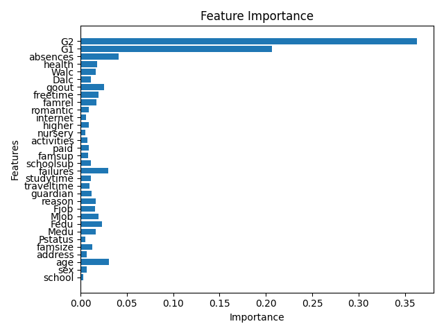
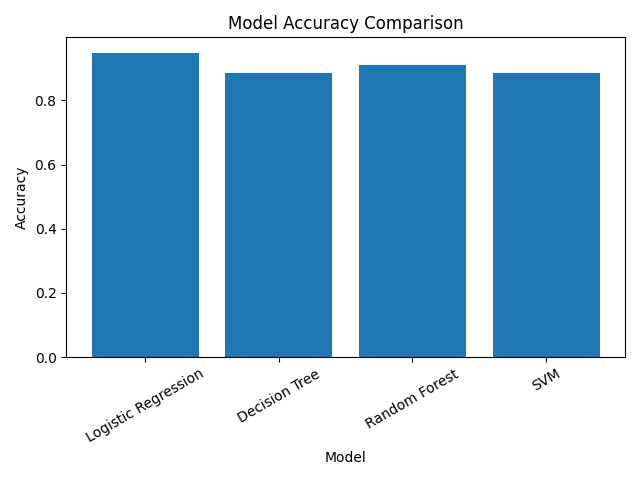

# Predicting Student Academic Performance Using Machine Learning

A BIGZ (highschool) capstone research project comparing five machine learning algorithms on the UCI Student Performance dataset, predicting both exact final grades (regression) and pass/fail outcomes (classification), with feature-importance analysis to identify what actually drives student outcomes.

## Dataset

[UCI Student Performance dataset](https://archive.ics.uci.edu/dataset/320/student+performance) — 395 students from a Portuguese secondary school, with 32 features covering demographics, family background, study habits, and prior grades (`G1`, `G2`), predicting final grade `G3`.

## Approach

- **Regression**: Linear Regression predicting exact final grade (`G3`) from all other features.
- **Classification**: Reframed as pass/fail (`G3 >= 10`), then compared four classifiers — Logistic Regression, Decision Tree, Random Forest, and SVM.
- **Feature importance**: Used Random Forest's built-in feature importances to identify which factors most influence outcomes.

## Results

**Regression (predicting exact grade):**

| Model | MSE | R² |
|---|---|---|
| Linear Regression | 5.03 | 0.75 |

**Classification (predicting pass/fail):**

| Model | Accuracy | Precision | Recall | F1 |
|---|---|---|---|---|
| Logistic Regression | 94.9% | 98.0% | 94.2% | 96.1% |
| Random Forest | 91.1% | 95.9% | 90.4% | 93.1% |
| Decision Tree | 88.6% | 92.2% | 90.4% | 91.3% |
| SVM | 88.6% | 90.6% | 92.3% | 91.4% |

**Feature importance**: prior grades (`G1`, `G2`) dominate, as expected — but `absences` and `failures` (past course failures) were the next most predictive non-grade features, ahead of demographic or family-background variables.




## Key takeaway

Logistic Regression — the simplest classifier tested — outperformed both Random Forest and the Decision Tree on this dataset. This was a useful lesson in not assuming more complex models automatically perform better: with ~400 samples and a fairly linear relationship between prior grades and final outcomes, a simple linear model generalized best.

## How to run

```bash
pip install pandas numpy matplotlib scikit-learn
python student_performance_analysis.py
```

Requires `student-mat.csv` (included) in the same directory. Outputs five image files: the feature importance chart, accuracy comparison chart, and three result tables.

## Note on this repo

The script includes two small fixes from the original, with no effect on the reported results:
1. **Categorical column detection** updated for newer pandas versions, where text columns use a dedicated string dtype instead of `object`.
2. **`random_state=42`** added to Decision Tree and Random Forest (the two models with internal randomness — bootstrap sampling and split tie-breaking), so re-running this script now reproduces the exact same numbers every time, not just numbers close to them.
